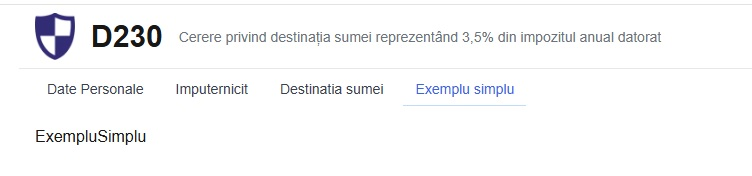
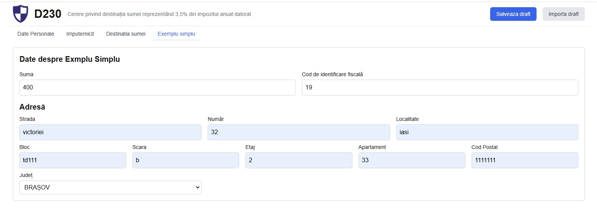
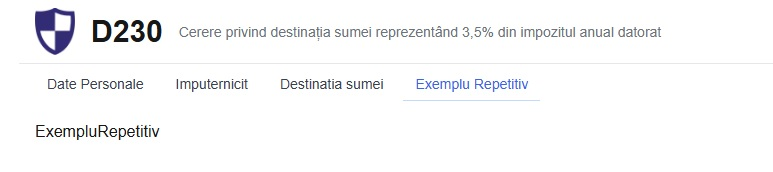
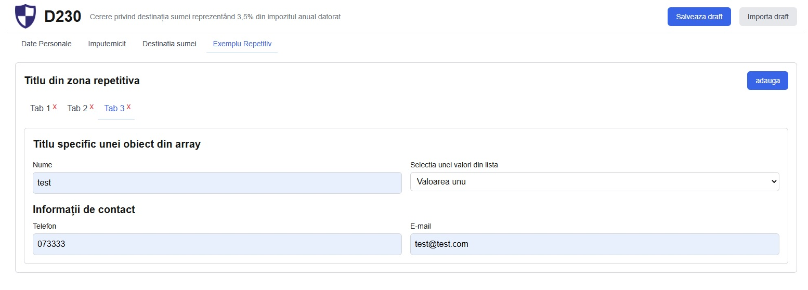
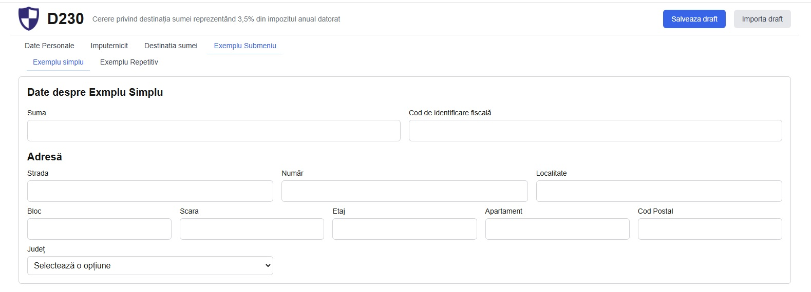
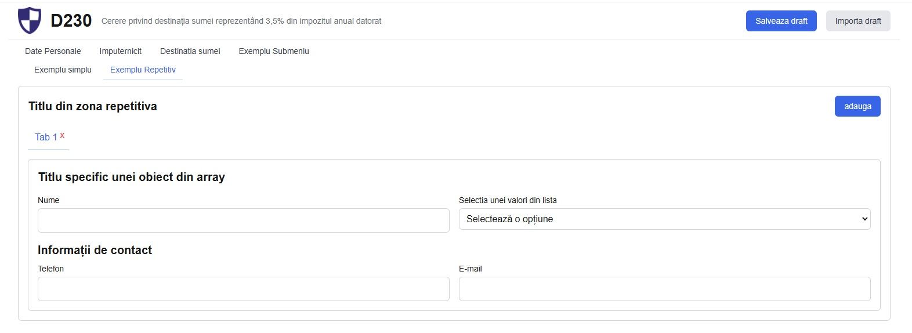
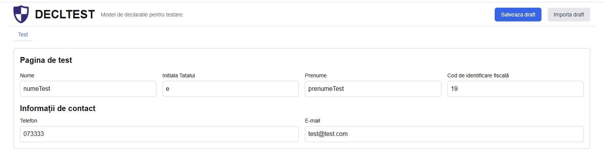

# Structura declaratiilor

## Structura directoare

```
project/
│
├── app
│   ├── imputernicit
│   └── destinatie
│       ├── entitate
│       └── bursa
│
├── components
│   ├── sharedcomponents
│   └── uicomponents
│
├── types
│
├── utils
│
└── docs
```

### explicatii structura directoare:

a. _app_

- in `app` tinem paginile.
- pagina default "/" este definita direct in `app` in fisierul page.tsx.
- celelate pagini sunt in subdirectoare a lui `app` in fisiere page.tsx.
- pentru aplicatia curenta avem:
  1. "/imputernicit" -> `app/imputernicit/page.tsx`
  2. "/destinatie/entitate" -> `app/destinatie/entitate/page.tsx`
  3. "/destinatie/bursa" -> `app/destinatie/bursa/page.tsx`
- > ATENTIE!!! (nu modificati) in directorul app este definit fisierul applicationcontext-provider.tsx si contine contextul intregului proiect

b. _components_:

- contine compenentele folosite in pagini, specifice paginilor
- in subdirectorul `uicomponents` sunt predefinite componentele reutilizabile ce pot fi adaugate in fiecare forma gen butonane, input, checkbox select etc.
- > ATENTIE!!! componentele din `uicomponents` nu trebuie modificate. orice modificare influenteaza aspectul si functionalitatea din intreaga aplicatie
- in subdirectorul `sharedcomponents` sunt predefinite componentele reutilizabile cu un continut functional mai complex gen Adresa, Contact ... Se pot modifca dar cu atentie

c. _types_:

- contine fisierul `types.ts` folosit pentru declararea tipurilor de date folosite in componentele din pagini
- ex:

```
export type Contact = {
  email: string;
  telefon: string;
};
```

ne indica faptul ca tipul Contact are doua atribute de tip string email si telefon.

- ex pentru tipul de date email: string componenta echivalenta este:

```
<InputComponent name='email' type='email' label='E-mail' value={email} />
```

value trebuie sa fie egala cu atributul email din tipul Contact

- > ATENTIE!!! tipurile ce pot fi folosite pentru declararea atributelor sunt string si boolean

c. _utils_:

- contine definirea diverselor librarii folosite in interiorul aplicatiei
- pentru acest proiect au fost definite trei fisiere typescript si anume:
  1. `helper.ts`
     - contine diverse functii utilitare
  2. `nomenclatoare.ts`
     - contine definitiile diverselor constante folosite in proiect
  3. `validare.ts`
     - contine diverse functii de validare
- aceste librarii vor fi actualizate dupa necesarul si specificul fiecarui proiect

d. _docs_:

- contine documentatia folosita pentru prezentarea aplicatiei
- directorul poate sa fie sters din aplicatiile care intra in productie

## Exemple de adaugare pagini

In continuare exemplificam modul de dezvoltare si creare al paginilor.

### exemplu creare pagina simpla:

Pagina o denumim exemplusimplu si o sa contina un input suma, un cif si componenta Adresa.

- in directorul `components` adaugam fisierul `ExempluSimplu.tsx` in care definim componenta ExempluSimplu

```
export default function ExempluSimplu() {
  return <div>ExempluSimplu</div>;
}
```

- in directorul `app` adaugam subdirectorul `exemplusimplu` in care punem fisierul `page.tsx` in care definim o componenta de pagina si importam componenta ExempluSimplu.

```
import ExempluSimplu from '@/components/ExempluSimplu';

export default function ExempluSimpluPage() {
  return (
    <main className='container mx-auto p-4'>
      <ExempluSimplu />
    </main>
  );
}
```

- in fisierul `utils/nomenclatoare.ts` adaugam noua pagina in constanta `pagini`:

```
export const pagini = [
  { id: 1, title: 'Date Personale', href: '/' },
  { id: 2, title: 'Imputernicit', href: '/imputernicit' },
  { id: 3, title: 'Destinatia sumei', href: '/destinatie/entitate' },
  { id: 4, title: 'Exemplu simplu', href: '/exemplusimplu' },
];
```

**Rezultatul pasilor este**\


- definim tipul de date pe care il folosim in pagina. In `types/types.ts` adaugam:

```
export type ExempluSimpluType = Adresa & {
  suma: string;
  cif: string;
};
```

- conform specificatiilor definite la inceput avem o componeta de tip Adresa care este deja definita si mai adaugam doua componente suma si cif
- tot in `types/types.ts` adaugam noul tip in FormElements (aici este definit intreg contextul aplicatiei) "exemplusimplu: ExempluSimpluType"

```
export type FormElements = {
  dateIdentificare: DateIdentificareType;
  dateImputernicit: DateImputernicitType;
  destinatii: DestinatieType[];
  exemplusimplu: ExempluSimpluType;
};
```

- tot in `types/types.ts` adaugam in PageModules (aici este definita evidenta paginilor) "exemplusimplu"

```
export type PageModules =
  | 'dateIdentificare'
  | 'dateImputernicit'
  | 'destinatii'
  | 'exemplusimplu';
```

- in `utils/nomenclatoare.ts` actualizam constanta `defaultFormValues` cu definirea valorilor initiale pentru noul element:

```
export const defaultFormValues: FormElements = {
  dateIdentificare: {
    initialaTata: '',
   ...
  },
  dateImputernicit: {
    initialaTata: '',
    ...
  },
  destinatii: [],
  exemplusimplu: {
    apartament: '',
    bloc: '',
    codpostal: '',
    etaj: '',
    judet: '',
    localitate: '',
    numar: '',
    scara: '',
    strada: '',
    cif: '',
    suma: '',
  },
};
```

- pentru finalizarea continutului in noua pagina adaugam componentele necesare in componenta ExempluSimplu

```
'use client';
import { use, useEffect } from 'react';
import { AppContext } from '../app/applicationcontext-provider';
import Cif from './uicomponents/Cif';
import InputComponent from './uicomponents/InputComponent';
import Address from './sharedcomponents/Address';

export default function ExempluSimplu() {
  const { elementeFormular, setActiveModule } = use(AppContext);

  useEffect(() => {
    setActiveModule('exemplusimplu');
  }, []);

  console.log('pagina exemplusiplu', elementeFormular);

  return (
    <div className='space-y-4 p-4 border border-gray-300 rounded-md'>
      {/* zona de titlu  */}
      <div className='flex justify-between items-center'>
        <h2 className='text-xl font-bold'>Date despre Exmplu Simplu</h2>
      </div>

      {/* adaugare componente suma si cif intr-un grid  */}
      <div className='grid grid-cols-1 md:grid-cols-2 gap-4 mt-2'>
        <InputComponent
          name='suma'
          label='Suma'
          type='number'
          value={elementeFormular.exemplusimplu.suma}
        />
        <Cif value={elementeFormular.exemplusimplu.cif} />
      </div>

      {/* adaugarea componenta Adresa */}
      <Address
        apartament={elementeFormular.exemplusimplu.apartament}
        bloc={elementeFormular.exemplusimplu.bloc}
        codpostal={elementeFormular.exemplusimplu.codpostal}
        etaj={elementeFormular.exemplusimplu.etaj}
        judet={elementeFormular.exemplusimplu.judet}
        localitate={elementeFormular.exemplusimplu.localitate}
        numar={elementeFormular.exemplusimplu.numar}
        scara={elementeFormular.exemplusimplu.scara}
        strada={elementeFormular.exemplusimplu.strada}
      />
    </div>
  );
}
```

**Constructia paginii este finalizat. Nu mai trebuie sa facem nimic iar rezultatul este:**\


---

### exemplu creare pagina cu elemente repetitive:

Pagina o denumim exemplurepetitiv si o sa contina un array de elemente care au un input nume, un dropdown selectieValori si componenta Contact.

- in directorul `components` adaugam fisierul `ExempluRepetitiv.tsx` in care definim componenta ExempluRepetitiv

```
export default function ExempluRepetitiv() {
  return <div>ExempluRepetitiv</div>;
}
```

- in directorul `app` adaugam subdirectorul `exemplurepetitiv` in care punem fisierul `page.tsx` in care definim o componenta de pagina si importam ExempluRepetitiv.

```
import ExempluRepetitiv from '@/components/ExempluRepetitiv';

export default function ExempluRepetitivPage() {
  return (
    <main className='container mx-auto p-4'>
      <ExempluRepetitiv />
    </main>
  );
}
```

- in fisierul `utils/nomenclatoare.ts` adaugam noua pagina in constanta `pagini`:

```
export const pagini = [
  { id: 1, title: 'Date Personale', href: '/' },
  { id: 2, title: 'Imputernicit', href: '/imputernicit' },
  { id: 3, title: 'Destinatia sumei', href: '/destinatie/entitate' },
  { id: 4, title: 'Exemplu Repetitiv', href: '/exemplurepetitiv' },
];
```

**Rezultatul pasilor este**\


- definim tipul de date pe care il folosim in pagina. In `types/types.ts` adaugam:

```
export type ExempluRepetitivType = Contact & {
  id: number;
  nume: string;
  selectieValori: string;
};
```

- conform specificatiilor definite la inceput avem o componeta de tip Contact care este deja definita si mai adaugam doua componente nume si selectieValori
- tot in `types/types.ts` actualizam cu noul tip in FormElements si in PageModules adaugam pagina

```
export type FormElements = {
  dateIdentificare: DateIdentificareType;
  dateImputernicit: DateImputernicitType;
  destinatii: DestinatieType[];
  exemplurepetitiv: ExempluRepetitivType[];
};

export type PageModules =
  | 'dateIdentificare'
  | 'dateImputernicit'
  | 'destinatii'
  | 'exemplurepetitiv';
```

- in `utils/nomenclatoare.ts` actualizam constanta `defaultFormValues` cu definirea valorilor initiale pentru noul element definit:

```
export const defaultFormValues: FormElements = {
  dateIdentificare: {
    initialaTata: '',
    ...
  },
  dateImputernicit: {
    initialaTata: '',
   ...
  },
  destinatii: [],
  exemplurepetitiv: [],
};
```

- in `utils/nomenclatoare.ts` definim constanta `listaSelectieExempluRepetitiv` ce contine elementele pentru popularea componentei de tip dropdown selectieValori

```
export const listaSelectieExempluRepetitiv: OptionType[] = [
  { id: '1', name: 'Valoarea unu' },
  { id: '2', name: 'Valoarea doi' },
  { id: '3', name: 'Valoarea trei' },
];
```

- adaugam componenta ComponentaRepetitiva in `components/ComponentaRepetitiva.tsx`. Aceasta va cuprinde elementele de tip ExempluRepetitivType si o sa fie utilizata in zona repetitiva

```
import { ExempluRepetitivType } from '@/types/types';
import InputComponent from './uicomponents/InputComponent';
import SelectComponent from './uicomponents/SelectComponent';
import { listaSelectieExempluRepetitiv } from '@/utils/nomenclatoare';
import Contact from './sharedcomponents/Contact';

type ComponentaRepetitivaProps = ExempluRepetitivType;

export default function ComponentaRepetitiva({
  id,
  email,
  nume,
  selectieValori,
  telefon,
}: ComponentaRepetitivaProps) {
  return (
    <div className='space-y-4 p-4 border border-gray-300 rounded-md'>
      {/* zona de titlu  */}
      <div className='flex justify-between items-center'>
        <h2 className='text-xl font-bold'>
          Titlu specific unei obiect din array
        </h2>
      </div>

      {/* adaugare componente suma si cif intr-un grid  */}
      <div className='grid grid-cols-1 md:grid-cols-2 gap-4 mt-2'>
        <InputComponent
          name='nume'
          label='Nume'
          type='text'
          value={nume}
          arrayId={id}
        />
        <SelectComponent
          label='Selectia unei valori din lista'
          name='selectieValori'
          options={listaSelectieExempluRepetitiv}
          value={selectieValori}
          arrayId={id}
        />
      </div>

      {/* adaugarea componenta Contact */}
      <Contact email={email} telefon={telefon} arrayId={id} />
    </div>
  );
}
```

- pentru finalizarea continutului in noua pagina adaugam componentele. Actualizam continutul componentei ExempluRepetitiv

```
'use client';
import { AppContext } from '@/app/applicationcontext-provider';
import { ExempluRepetitivType } from '@/types/types';
import { use, useEffect, useState } from 'react';
import ComponentaRepetitiva from './ComponentaRepetitiva';
import Button from './uicomponents/Button';
import TabButton from './uicomponents/TabButton';

export default function ExempluRepetitiv() {
  const { elementeFormular, setElementeFormular, setActiveModule } =
    use(AppContext);

  const [activeTab, setActiveTab] = useState<number>(0);

  useEffect(() => {
    setActiveModule('exemplurepetitiv');
    const firstElement = elementeFormular.exemplurepetitiv.find(
      (elem) => elem.id !== undefined
    );
    if (firstElement) {
      setActiveTab(firstElement.id);
    }
  }, []);

  // functia care adauga un element nou in array
  const addNewElement = () => {
    const newElement: ExempluRepetitivType = {
      id: Date.now(),
      email: '',
      nume: '',
      selectieValori: '',
      telefon: '',
    };
    setElementeFormular({
      ...elementeFormular,
      exemplurepetitiv: [...elementeFormular.exemplurepetitiv, newElement],
    });
    setActiveTab(newElement.id);
  };

  // functia care sterge un element din array
  const removeElement = (id: number) => {
    const removeElement = elementeFormular.exemplurepetitiv.filter(
      (elem) => elem.id !== id
    );
    setElementeFormular({
      ...elementeFormular,
      exemplurepetitiv: removeElement,
    });
  };

  // console.log('entitate nonprofile page', elementeFormular);
  return (
    <div className='space-y-4 p-4 border border-gray-300 rounded-md'>
      <div className='flex justify-between items-center'>
        {/* titlu din pagina ce contine elementele repetitive */}
        <h2 className='text-xl font-bold'>Titlu din zona repetitiva</h2>
        {/* butonul care adauga un element nou in array */}
        <Button
          title='adauga'
          css='px-4 bg-blue-600 text-white hover:bg-blue-700'
          onclick={addNewElement}
        />
      </div>
      <div className='flex mt-4'>
        {/* afisarea butoanelor din tab */}
        {elementeFormular.exemplurepetitiv.map((elem, index) => {
          return (
            <TabButton
              key={elem.id}
              activeTab={activeTab}
              id={elem.id}
              label={`Tab ${index + 1}`}
              setActiveTab={setActiveTab}
              removeDestinatie={removeElement}
            />
          );
        })}
      </div>
      {/* afisarea continului din tab */}
      {elementeFormular.exemplurepetitiv.map((elem) =>
        activeTab === elem.id ? (
          <ComponentaRepetitiva key={elem.id} {...elem} />
        ) : undefined
      )}
    </div>
  );
}
```

**Constructia paginii este finalizat. Nu mai trebuie sa facem nimic iar rezultatul este:**\


---

### exemplu creare submeniu:

In meniul principal o sa adaugam un link nou `submeniu` si o sa defineasca contextul pentru doua pagini. O sa folosim ca exemplu cele doua pagini definite anterior.

- in directorul `app` adaugam `submeniu` cu subdirectoarele `exemplusimplu` si `exemplurepetitiv`
- nu mai definesc constructia paginilor, se folosesc pasii descrisi anterior

```
project/
│
└─ app
   └── submeniu
       ├── exemplusimplu
       └── exemplurepetitiv

```

- in fisierul `utils/nomenclatoare.ts` adaugam noua pagina in constanta `pagini` si definim constanta `submeniuExemplu`:

```
export const pagini = [
  { id: 1, title: 'Date Personale', href: '/' },
  { id: 2, title: 'Imputernicit', href: '/imputernicit' },
  { id: 3, title: 'Destinatia sumei', href: '/destinatie/entitate' },
  { id: 4, title: 'Exemplu Submeniu', href: '/submeniu/exemplusimplu' },
];

export const submeniuExemplu = [
  { id: 1, title: 'Exemplu simplu', href: '/submeniu/exemplusimplu' },
  { id: 2, title: 'Exemplu Repetitiv', href: '/submeniu/exemplurepetitiv' },
];
```

- in directorul `app/submeniu` adaugam fisierul `layout.tsx` in care importam constanta `submeniuExemplu`:

```
import Submenu from '@/components/sharedcomponents/Submenu';
import { submeniuExemplu } from '@/utils/nomenclatoare';

export default function ExempluLayout({
  children,
}: {
  children: React.ReactNode;
}) {
  return (
    <>
      <Submenu listSubmenu={submeniuExemplu} />
      {children}
    </>
  );
}
```

- construim cele doua pagini

**Rezultatul final este:**\



---

In pasii anteriori am descris modul de construire al interfetei grafice si componentelor necesare pentru functionarea aplicatiei.
In continuare o sa vedem cum personalizam aplicatia si cum rezolvam exportul si importul din xml.

### exemplu personalizare aplicatie:

- in `utils/nomenclatoare.ts` trebuie sa modificam urmatoarele constante:

```
// nume declaratie
export const numeDeclaratie = 'DECLTEST';

// explicație declaratie
export const explicatieDeclaratie = 'Model de declaratie pentru testare.';

// nume fisier xml generat
export const numeFisierXml = 'test.xml';
```

### exemplu de creare a unui xml foarte simplu:

O sa construim o singura pagina ce va contine elemente de tip PersonDataType, Contact si cif.

- in `types/types.ts` definim:

```
export type TestType = PersonDataType & Contact & { cif: string };

export type FormElements = {
  test: TestType;
};

export type PageModules = 'test';
```

- in `utils/nomenclatoare.ts` definim:

```
// lista de pagini afisate in menniu
export const pagini = [{ id: 1, title: 'Test', href: '/' }];

// valori default pentru declaratie
export const defaultFormValues: FormElements = {
  test: {
    initialaTata: '',
    nume: '',
    prenume: '',
    email: '',
    telefon: '',
    cif: '',
  },
};
```

- in `components` definim componenta TestComponent in fisierul `TestComponent.tsx` si adaugam componentele necesare in pagina:

```
'use client';

import { AppContext } from '@/app/applicationcontext-provider';
import { use, useEffect } from 'react';
import Contact from './sharedcomponents/Contact';
import PersonData from './sharedcomponents/PersonData';
export default function TestComponent() {
  const { elementeFormular, setActiveModule } = use(AppContext);

  useEffect(() => {
    setActiveModule('test');
  }, []);

  console.log('pagina test', elementeFormular);
  return (
    <div className='space-y-4 p-4 border border-gray-300 rounded-md'>
      <div className='flex justify-between items-center'>
        <h2 className='text-xl font-bold'>Pagina de test</h2>
      </div>

      <PersonData
        nume={elementeFormular.test.nume}
        prenume={elementeFormular.test.prenume}
        cif={elementeFormular.test.cif}
        initialaTata={elementeFormular.test.initialaTata}
      />

      <Contact
        email={elementeFormular.test.email}
        telefon={elementeFormular.test.telefon}
      />
    </div>
  );
}
```

**Rezultatul pasilor este**\


- pentru exportul continutului acestei forme in `utils/helper.ts` editam functia `generateXML` asfel:

```
export function generateXML(formData: FormElements): string {
  const xmlParts = ['<?xml version="1.0"?>'];
  const header = [
    '<decltest',
    `nume="${formData.test.nume}"`,
    `initiala="${formData.test.initialaTata}"`,
    `prenume="${formData.test.prenume}"`,
    `telefon="${formData.test.telefon}"`,
    `email="${formData.test.email}"`,
    `cif="${formData.test.cif}"`,
    `/>`,
  ].join(' ');
  xmlParts.push(header);

  // ✅ Îmbinăm stringurile fără separator greșit
  return xmlParts.join('\n');
}
```

- conform setarilor facute in proiect, dupa ce completam macheta si apasam butonul `Salveaza draft` o sa generam un fisier xml cu numele `test.xml` si continutul:

```
<?xml version="1.0"?>
<decltest nume="numeTest" initiala="e" prenume="prenumeTest" telefon="073333" email="test@test.com" cif="19" />
```

- ca sa importam un xml existent in `utils/helper.ts` editam functia `parseXML` asfel:

```
export function parseXML(xml: string): FormElements {
  const xmlDoc = new DOMParser().parseFromString(xml, 'text/xml');

  const rootNode = xmlDoc.getElementsByTagName('decltest')[0];
  const formData: FormElements = defaultFormValues;

  formData.test.nume = rootNode.getAttribute('nume') || '';
  formData.test.initialaTata = rootNode.getAttribute('initiala') || '';
  formData.test.prenume = rootNode.getAttribute('prenume') || '';
  formData.test.cif = rootNode.getAttribute('cif') || '';
  formData.test.telefon = rootNode.getAttribute('telefon') || '';
  formData.test.email = rootNode.getAttribute('email') || '';

  return formData;
}
```

- dupa modificarea anterioara prin apasarea butonului `Importa draft` datele din fisierul xml vor fi mapate si afisate in pagina.
